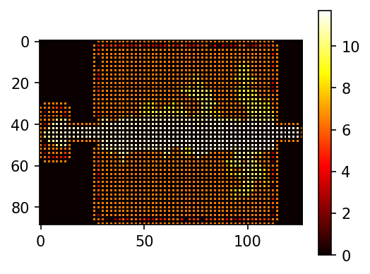
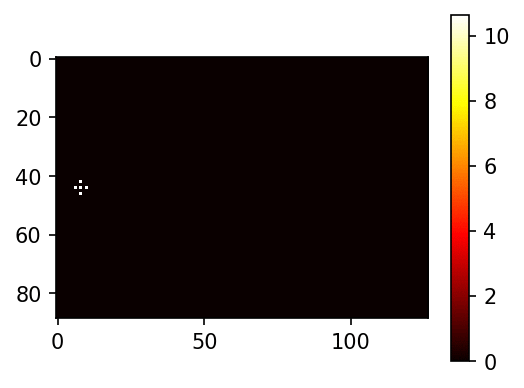

# The World's Hardest Game Q-Learning

This is an implementation of the flash game **The World's Hardest Game** and of a Q-Learning algorithm to play it. This fork contains numerous improvements over the original repo.

Documentation is lacking, but you should be able to decypher what is going on.

## Running

Run `run_me.ipynb`

## Output

Output is generated in the folder `result`

Example of images generated

